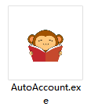
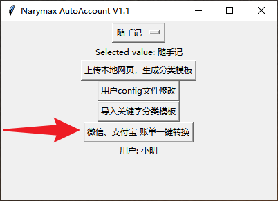

# Narymax_AutoAccount
针对微信、支付宝账单，根据自定义关键字匹配商家、商品名称，进行二级分类，导入记账软件

## 数据提取支持功能
- 多用户记账设置
- 自定义二级分类
- 关键字分类匹配
- 交易号屏蔽
- 支持项目分类
- 商家区分（微信、支付宝）

 

## 需要条件
下载relese文件夹下面的[rumMain.exe](release/AutoAccount.exe)、[yaml配置文件](release/小明Config.yaml)，都放到一个英文路径下面 

## 使用方法
1. 导出微信、支付宝原始账单，准备csv账单（手机可以操作） 
参考教程：
[微信账单导出](https://docs.qianjiapp.com/other/import_guide_weixin.html)
[手机支付宝账单导出](https://docs.qianjiapp.com/other/import_guide_alipay_app.html)
2. 下载AutoAccount转换软件,点击一键转换  
  

3. [从软件路径下找到转换账单，上传记账软件](#记账app适配更新状态)

## 其它功能介绍
1. [上传本地网页，生成分类模板](doc/sui_html_to_yaml.md)
3. [用户config文件说明](doc/user_config.md)
4. [关键字模板自定义](doc/my_keywords_edit.md)

## 记账app适配更新状态

* 已支持    ✔
* 老鸽开发中 ⭕
* 鸽了 🦆

| 记账app    | pic                                                 | 支持  |
|----------|-----------------------------------------------------|-----|
| [随手记](doc/sui.md)  |  | ✔   |
 | Timi时光记账 |                  | 🦆  |
 | 口袋记账     |               | 🦆  |
 | 可萌记账     |        | 🦆  |
 | 挖财记账     |            | 🦆  |
 | 有鱼记账     |                | 🦆  |
 | 松鼠记账     |           | 🦆  |
 | 洋葱记账     |         | 🦆  |
 | 百事AA记账   |   | 🦆  |
 | 薄荷记账     |                | 🦆  |
 | 记账·海豚记账本 |           | 🦆  |
 | 钱迹       |                | ⭕   |
 | 鲨鱼记账     |          | 🦆  |

## 欢迎更多老鸽来 PR

## 配置文件说明
config.yaml
- user: 用户名字，记账人 
- character: 通常就是字母，会添加到付款账号的前面，作为用户账户的一个标记
- min_pay_filter: 低于指定金额的不记账
- default_proj_name: 默认项目名称

## 关于项目
本项目是个人记账使用的小软件，目前界面还很毛坯，持续优化中