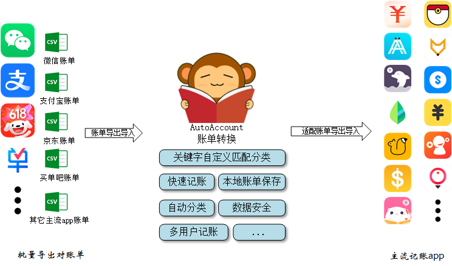
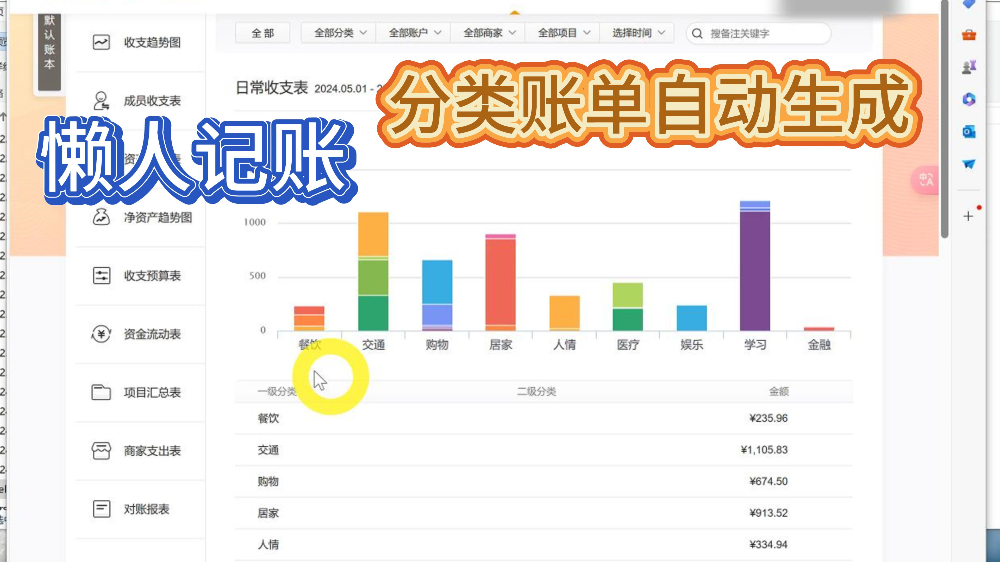
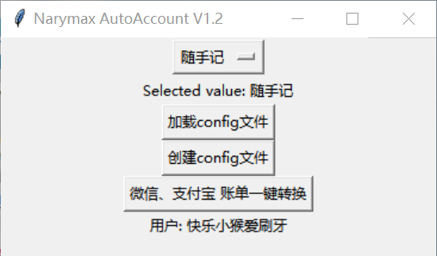
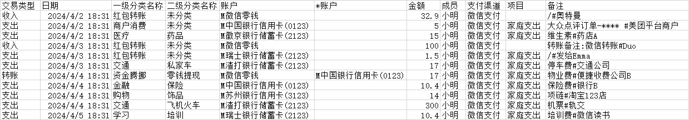

# Narymax_AutoAccount快速记账项目
针对微信、支付宝等账单，根据自定义关键字匹配商家、商品名称，进行二级分类，导入记账软件

[](https://github.com/Narymax/Narymax_AutoAccount)
[](https://gitee.com/Naymax/Narymax_AutoAccount)
</br>
[blibli: 【自动记账，懒人记账，微信支付宝账单合并，自动分类（自定义账单商家或商品识别关键字后，可以几分钟记完两个月的流水账）】]( https://www.bilibili.com/video/BV13JTge4Emi/?share_source=copy_web&vd_source=8501da08a2b809d0ff4d9cc3d78c6643)
## 项目简介
本项目是从用户私人账单到主流记账软件的转换项目，虽然有的记账软件app本身支持账单导入功能，但是使用效果不尽人意，而且把个人的敏感数据也一并上传了。

因此才有了本项目的设计初衷，通过自定义分类关键字，或者文本分类模型，使得导入账单的同时，完成自动分类，而且数据本地保存，随时可以切换记账app，软件生成的账单导过去即可。




## 下载链接
ver 1.4.1
链接: https://pan.baidu.com/s/1-X_ecihkzrpm-C40uZ4bJA?pwd=bp7y 提取码: bp7y
## 更新状态
AutoAccount_V1.4.1
- 支持```微信```、```支付宝账单```、```京东账单```到```随手记```、```钱迹```、```挖财记账```、```有鱼记账```、```百事AA记账```的自定义模板导入适配
- 支持```微信账单```格式导入的记账app
## 数据提取支持功能
- 多用户记账设置
- 用户分类信息提取
- 自定义二级分类
- 付款银行卡信息提取
- 关键字分类匹配
- 交易号屏蔽
- 支持项目分类
- 商家区分（微信、支付宝、...）


</br>


## 需要条件
下载relese文件夹下面的[rumMain.exe](release/AutoAccount.exe)，放到英文路径下面 

## 使用方法
1. 导出微信、支付宝原始账单，准备csv账单（手机可以操作）  
参考教程：  
[微信账单导出](https://docs.qianjiapp.com/other/import_guide_weixin.html)  
[手机支付宝账单导出](https://docs.qianjiapp.com/other/import_guide_alipay_app.html)  
2. 下载AutoAccount转换软件,下拉列表切换记账app,默认随手记,点击最下面的```一键转换```   

[](release/AutoAccount.exe)   

  
3. [从软件路径下找到转换账单，上传记账软件](#记账app适配更新状态)

## 其它功能介绍
1. [上传本地网页，生成分类模板](doc/sui_html_to_xls.md)
2. [加载cinfig文件，config文件及关键字说明](doc/user_config.md)
3. [创建config文件](doc/create_config.md)


## 记账app适配更新状态

* 已支持    ✔
* 老鸽开发中 ⭕
* 鸽了 🦆

| 记账app    | pic                                                  | 支持状态       | 模板链接                                                                                                             |记账app    | pic                                                | 支持状态      | 模板链接                                                                                                                                                                                        |
|----------|------------------------------------------------------|------------|------------------------------------------------------------------------------------------------------------------|---------|----------------------------------------------------|-----------|---------------------------------------------------------------------------------------------------------------------------------------------------------------------------------------------|
| [随手记](doc/sui.md)  | [](doc/sui.md) | ✔          | [随手记自定义模板](res/target_app_tample/随手记导入模板-自定义.xls)  <br> [官网说明](https://www.sui.com/data/standard_data_import.do) | 松鼠记账     |          | 🦆        | 没找到                                                                                                                                                                                         |
| Timi时光记账 |                   | ✔         | 好像支持微信导入                                                                                                         | 洋葱记账     |        | 🦆        | 没找到                                                                                                                                                                                         |
| 口袋记账     |                | 🦆 | 不支持自定义模板导入                                                                                                       | 百事AA记账   |  | ✔         | [百事AA记账收支模板](res/target_app_tample/百事AA记账V1/收入支出导入模板-v3.xlsx) <br>  [百事AA记账转账模板](res/target_app_tample/百事AA记账V1/转账导入模板.xlsx) <br>  [官网说明](https://aa.bestrie.com/user/project/import/index) |
| 可萌记账     |         | 🦆         | 没找到                                                                                                              | 薄荷记账     |               | 🦆        | 没找到                                                                                                                                                                                         |
| 挖财记账     |             | ✔         | [挖财导入自定义模板](res/target_app_tample/挖财导入模板-自定义.xls)    <br> [官网说明](https://jz.wacaijizhang.com/jz-pc/import)       | 记账·海豚记账本 |          | 🦆| 不支自定义持模板导入                                                                                                                                                                                  |
| 有鱼记账     |                 | ✔         | [有鱼记账自定义模板](res/target_app_tample/有鱼记账导入模板-自定义.xls)    <br>   [官网说明](https://jz.yofish.com/jzweb/import)         | 钱迹       |               | ✔          | [钱迹导入自定义模板](res/target_app_tample/钱迹导入模板-自定义_V6.csv)  <br> [官网说明](https://docs.qianjiapp.com/other/import_templete.html)                                                                    |
| 鲨鱼记账     |           |   🦆  | 不支持模板导入                                                                                                          |Daak记账|        |⭕| 待定<br> 好像支持微信导入                                                                                                                                                                             |
| 喵喵记账 |                 | ✔ | 支持微信模板导入                                                                                                         |一木记账|      |⭕| 待定                                                                                                                                                                                          |
| 卡片记帐 |           | 🦆 | 待定                                                                                                               ||                                                    ||                                                                                                                                                                                             |


## 欢迎更多老鸽来 PR
main入口
run  ```AutoAccount.py```
</br>
python 3.6.15
[环境依赖](requirements.txt)

## 配置文件说明
config.xls
- user: 用户名字，记账人 
- character: 通常就是字母，会添加到付款账号的前面，作为用户账户的一个标记，不需要可以不填
- min_pay_filter: 低于指定金额的不记账
- default_proj_name: 默认项目名称

### 标准账单模板
[](doc/标准账单.md)

[标准账单](doc/标准账单.md)
## 关于项目
本项目是个人记账使用的小软件，目前界面还很毛坯，持续优化中

## 更新日志

注：使用pyinstaller 打包
### 2024-05-21
交易号屏蔽（超过9位），但是保留手机号码
### 2024-05-22
更新UI
### 2024-06-06
更新京东账单适配，分类关键字匹配规则细化为，支出分类模板、收入分类模板
### 2024-06-10 version1.4
- 添加对"钱迹","挖财记账","有鱼记账","百事AA记账" 的自定义导入模板的适配
- 使用config.xls文件作为配置文件
- 支持xls自定义分页、csv、xlxs最终模板生成
### 2024-06-20 version1.4.1
- 添加导出微信模板，适配能够使用微信导入账单的记账app,例如喵喵记账、daak记账
- 生成默认配置xls文件时，带有自定义支出分类定义关键字示例