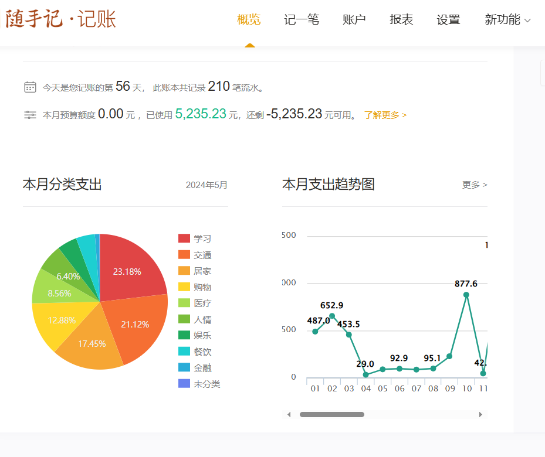

# Narymax_AutoAccount快速记账项目
针对微信、支付宝等账单，根据自定义关键字匹配商家、商品名称，进行二级分类，导入记账软件

[](https://github.com/Narymax/Narymax_AutoAccount)
[](https://gitee.com/Naymax/Narymax_AutoAccount)
</br>
[blibli: 【自动记账，懒人记账，微信支付宝账单合并，自动分类（自定义账单商家或商品识别关键字后，可以几分钟记完两个月的流水账）】]( https://www.bilibili.com/video/BV13JTge4Emi/?share_source=copy_web&vd_source=8501da08a2b809d0ff4d9cc3d78c6643)
## 项目简介
本项目是从用户私人账单到主流记账软件的转换项目，虽然有的记账软件app本身支持账单导入功能，但是使用效果不尽人意，而且把个人的敏感数据也一并上传了。

因此才有了本项目的设计初衷，通过自定义分类关键字，或者文本分类模型，使得导入账单的同时，完成自动分类，而且数据本地保存，随时可以切换记账app，软件生成的账单导过去即可。


## 更新状态
AutoAccount_V1.2
- 支持微信、支付宝账单到随手记的适配

## 数据提取支持功能
- 多用户记账设置
- 用户分类信息提取
- 自定义二级分类
- 付款银行卡信息提取
- 关键字分类匹配
- 交易号屏蔽
- 支持项目分类
- 商家区分（微信、支付宝、...）


</br>


## 需要条件
下载relese文件夹下面的[rumMain.exe](release/AutoAccount.exe)，放到英文路径下面 

## 使用方法
1. 导出微信、支付宝原始账单，准备csv账单（手机可以操作）</br>
参考教程：
[微信账单导出](https://docs.qianjiapp.com/other/import_guide_weixin.html)
[手机支付宝账单导出](https://docs.qianjiapp.com/other/import_guide_alipay_app.html)
2. 下载AutoAccount转换软件,点击一键转换 </br>

[](release/AutoAccount.exe) 
</br>

3. [从软件路径下找到转换账单，上传记账软件](#记账app适配更新状态)

## 其它功能介绍
1. [上传本地网页，生成分类模板](doc/sui_html_to_xls.md)
2. [加载cinfig文件，config文件及关键字说明](doc/user_config.md)
3. [创建config文件](doc/create_config.md)


## 记账app适配更新状态

* 已支持    ✔
* 老鸽开发中 ⭕
* 鸽了 🦆

| 记账app    | pic                                                 | 支持状态  |
|----------|-----------------------------------------------------|-----|
| [随手记](doc/sui.md)  | [](doc/sui.md) | ✔   |
 | Timi时光记账 |                  | 🦆  |
 | 口袋记账     |               | 🦆  |
 | 可萌记账     |        | 🦆  |
 | 挖财记账     |            | 🦆  |
 | 有鱼记账     |                | 🦆  |
 | 松鼠记账     |           | 🦆  |
 | 洋葱记账     |         | 🦆  |
 | 百事AA记账   |   | 🦆  |
 | 薄荷记账     |                | 🦆  |
 | 记账·海豚记账本 |           | 🦆  |
 | 钱迹       |                | ⭕   |
 | 鲨鱼记账     |          | 🦆  |


## 欢迎更多老鸽来 PR
main入口
run  ```AutoAccount.py```
</br>
python 3.6.15
[环境依赖](requirements.txt)

## 配置文件说明
config.yaml
- user: 用户名字，记账人 
- character: 通常就是字母，会添加到付款账号的前面，作为用户账户的一个标记
- min_pay_filter: 低于指定金额的不记账
- default_proj_name: 默认项目名称

### 标准账单模板


[标准账单](doc/标准账单.md)
## 关于项目
本项目是个人记账使用的小软件，目前界面还很毛坯，持续优化中