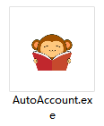

# 随手记自动记账

## 二级分类数据抓取
1. 保存html
[网页登录自己的随手记账号，保存html至本地](https://www.sui.com/category/budgetCategory.do)

Ctrl + S 保存成html文件到本地

2. 打开  生成yaml模板文件 auto_classify_config_tample.yaml，这个文件只需要生成一次，以后记账的时候会读取这个文件

3. 编辑备注自定义关键词

打开账单查看商户和商品中频率较高的关键词，例如每个月都在指定的商家消费，那么可以把那个商家的名字加到指定分类的关键字里面，导入账单时就不用手动选择分类

## 生成随手记可识别的账单模板
1. 导入用户配置文件，确定是谁在记账（pony or jack or 小明）

2. 导入微信或支付宝账单，进行转换

3. 在exe文件目录下生成转换好的账单
## 为保险起见，检查一下生成的账单😁
这个账单就是导入随手记的最终账单，如果不希望把备注内容上传到随手记，可以把备注那一列的内容清空

## ！！！导入账单
最重要的一步，随手记不支持导入后再撤消，所以要确认好信息再导入
1. 打开随手记网页端

2. 导入上面生成的账单
