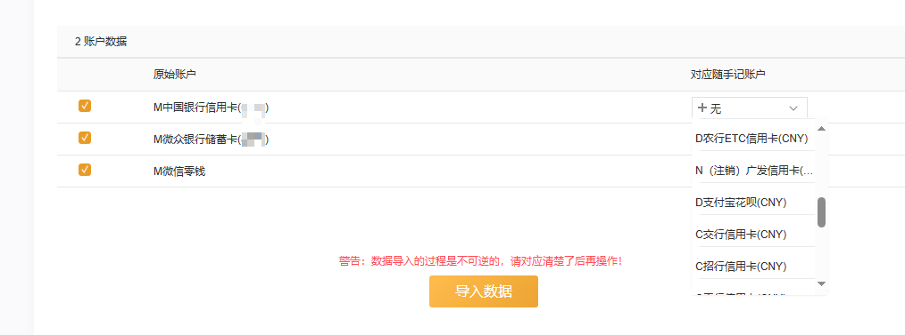
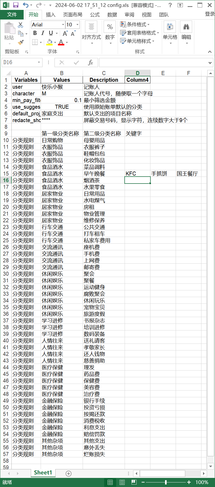

软件默认加载config文件夹下的config.xls配置文件，若找不到指定文件，则使用如下信息
文件包含信息如下
```yaml
user: 小明
# 代号，随便一个字母
character: M
# 交易金额低于些数值的不参入统计
min_pay_filter: 0.1
# 是否使用支付宝、微信系统智能分类作为第一级分类，不使用的话就是'其它'
use_suggesstion_classify: True
# 默认 项目名称
default_proj_name: 家庭支出
```


## user 记账人
多人记账，可以把user修改成指定成员
## character 代号
character字母默认添加到账户名称的前面，例如设置小张的字母是Z：

小明账单中一张卡是：中国银行(1234)  --导出-->  M中国银行(1234) 
</br>
小张账单中一张卡是：中国银行(2234)  --导出-->  Z中国银行(2234)
</br>

那么在账单导入时更方便的到记账软件里面选择对应账号


左边是autoaccount软件导出账户名称，右边是记账软件中的账户设置，如果左右相同的话会自动匹配，不需要手动勾选

## default_proj_name 默认项目名称
支出的项目名称，不需要的话可以删除

## 二级分类关键字表
在每个二级分类后面添加关键字，编辑后保存这个excel文档，然后软件再加载该config.xls生效
